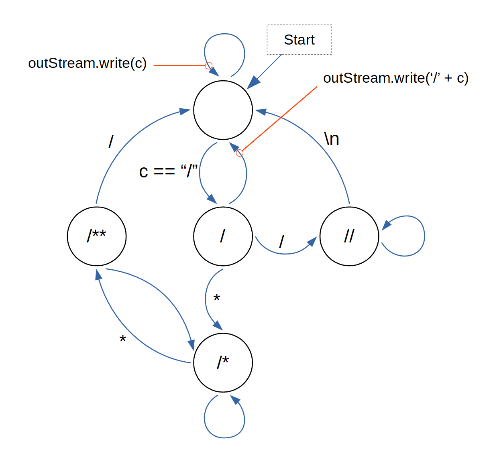

## Question

Complete the implementation of the `removeComments` function, which uses a ReadStream and a WriteStream to remove JavaScript comments on-the-fly. Most of the code is already provided; **your task is to complete the `handleStream` function**, which is an event listener passed to the 'data' event of the ReadStream.

The data read from the ReadStream is a string containing some JavaScript code, and you should remove all the comments:
- Inline comments: sequence of string starting with `//` and ending in a newline character `\n`.
- Multi-line comments: sequence of string starting with `/*` and ending with `*/`.

**NOTE:** You cannot make any assumptions about the length of the `blob` that is read each time, and you cannot make any assumptions about the length of the input file. Your program should operate in streaming mode, i.e., it should count the phrases as and when they are read and not buffer the data until the end (no points will be given otherwise). Further, your program should not block on I/O operations.

**HINT:**
- Think of your program as a state machine. You can use the `state` variable to keep track of the state of your program.
- Write your processed string to `outStream`.

---

```javascript
'use strict';

process.stdin.resume();
process.stdin.setEncoding('utf-8');

function removeComments(inputStream, outputStream, done){
    var state = '';
    /*
     * Complete the 'handleStream' function below.
     *
     * The function accepts string chunk as parameter.
     * The function should return a Function.
     */
    function handleStream(blob) {

    }
    inputStream.on('data', handleStream);
    inputStream.on('end', done);
}

removeComments(process.stdin, process.stdout, function(){
    process.exit();
});
```


## Solution

You can think of the program as a state machine, as illustrated in the diagram below.



```javascript
'use strict';

process.stdin.resume();
process.stdin.setEncoding('utf-8');

function removeComments(inputStream, outputStream, done){
    var state = '';
    /*
     * Complete the 'handleStream' function below.
     *
     * The function accepts string chunk as parameter.
     * The function should return a Function.
     */
    function handleStream(blob) {
        for (var i = 0; i < blob.length; i ++){
            if (state === '/'){
                if (blob[i] === '/'){
                    state = '//';
                }
                else if (blob[i] === '*'){
                    state = '/*';
                }
                else {
                    outputStream.write('/' + blob[i]);
                    state = '';
                }
            }
            else if (state === '//'){
                if (blob[i] === '\n'){
                    state = '';
                }
            }
            else if (state === '/*'){
                if (blob[i] === '*'){
                    state = '/**';
                }
            }
            else if (state === '/**'){
                if (blob[i] === '/'){
                    state = '';
                }
                else {
                    state = '/*';
                }
            }
            else {
                if (blob[i] === '/'){
                    state = '/';
                }
                else {
                    outputStream.write(blob[i]);
                }
            }
        }
    }
    inputStream.on('data', handleStream);
    inputStream.on('end', done);
}

removeComments(process.stdin, process.stdout, function(){
    process.exit();
});
```
